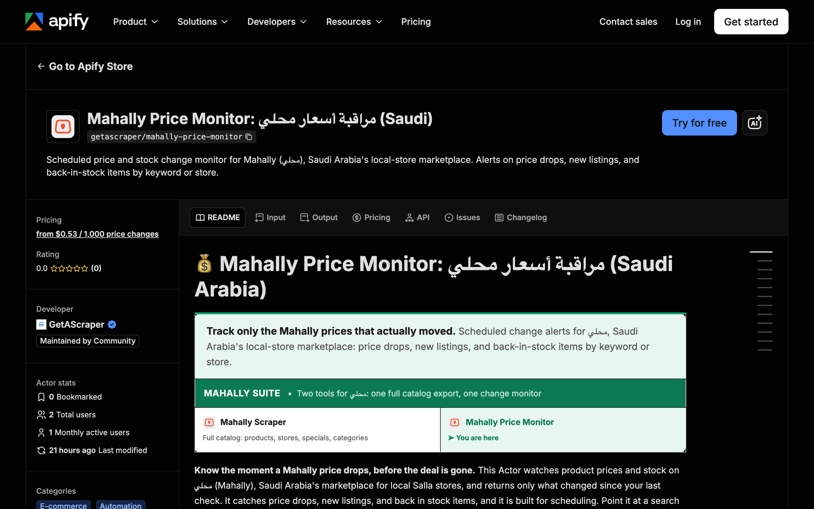

<div align="center">

# Mahally Price Monitor: Price and Stock Change Alerts

[](https://apify.com/getascraper/mahally-price-monitor)
[](https://apify.com/getascraper/mahally-price-monitor)
[](https://apify.com/getascraper/mahally-price-monitor)
[](https://github.com/getascraper/how-to-scrape-mahally-price-monitor/issues)
[](https://github.com/getascraper/how-to-scrape-mahally-price-monitor/commits/main)

Scheduled price and stock change monitor for Mahally, Saudi Arabia's local store marketplace. Alerts on price drops, new listings, and back in stock items by keyword or store.

[](https://apify.com/getascraper/mahally-price-monitor)

</div>

---

## Why use Mahally Price Monitor

* **Only changed rows**: Every scheduled run returns just the products whose price or stock moved, not a full re-download.
* **Search by keyword or store**: Track products with Arabic or English keywords, or watch every product from one seller.
* **Bilingual results**: Product names come back in both Arabic and English, so nothing gets lost on export.
* **Built for schedules**: Point it at a search once, then let Apify Schedules run it daily or hourly.
* **No wasted spend**: An empty run where nothing changed costs nothing, since pricing is pay per result.

---

## How to use Mahally Price Monitor

1. Add search keywords in Arabic or English, or paste Mahally store IDs to watch every product from a store.
2. Keep "only emit changed items" turned on so every run returns just what moved.
3. Click **Start**: The actor collects every matching record and writes one flat row per item.
4. **Download your results**: Export as Excel, CSV, JSON, or HTML from the Output tab.

---

## Input

| Field | Type | Required | Description |
| --- | --- | :---: | --- |
| `searchTerms` | array of text | No | Arabic or English keywords to track, for example قهوة or coffee. |
| `storeIds` | array of text | No | Mahally store IDs to monitor all products from. Find the ID in a store URL: mahally.com/ar/stores/id/. |
| `onlyChanged` | boolean | No | When enabled, only rows whose price or stock changed since the last run are returned. |
| `maxPagesPerQuery` | integer | No | Maximum number of result pages fetched per search term or store. |
| `hitsPerQuery` | integer | No | Number of products fetched per result page. |
| `maxItems` | integer | No | Maximum number of product rows returned in total. 0 means unlimited. |
| `proxyConfiguration` | object | No | Proxy settings. The default works well since the data comes from a public product listing. |

---

## Output

Each row in your dataset is one product, with pricing, discount, store details, and change history. All fields are flat with no nested data, so the file opens cleanly in any spreadsheet program.

```json
{
  "query": "قهوة",
  "queryType": "searchTerm",
  "productId": "48213590",
  "name": "عرض قهوة مختصة",
  "nameEn": "Specialty Coffee Bundle",
  "price": 108,
  "salePrice": 108,
  "regularPrice": 140,
  "discountPercentage": 22.86,
  "hasSpecialPrice": true,
  "inStock": true,
  "status": "available",
  "storeId": "1642664758",
  "storeName": "متجر القهوة السعودي",
  "storeRating": 4.6,
  "city": "جدة",
  "categories": ["أطعمة ومشروبات", "قهوة"],
  "brandNameAr": "بن العرب",
  "brandNameEn": "Bunn Al Arab",
  "imageUrl": "https://cdn.mahally.com/products/48213590.jpg",
  "rating": 4.8,
  "storeUrl": "https://mahally.com/ar/stores/1642664758/",
  "changeType": "PRICE_DROP",
  "oldPrice": 140,
  "priceDelta": -32,
  "priceDeltaPct": -22.86,
  "oldInStock": true,
  "isChanged": true,
  "scrapedAt": "2026-07-06T00:02:24.004Z"
}
```

### Data table

| Field | Type | Description |
| --- | :---: | --- |
| `query` | string | The search keyword or store ID that produced this row. |
| `productId` | string | Mahally product ID. |
| `name` | string | Product name in Arabic. |
| `nameEn` | string | Product name in English. |
| `price` | number | Current price shown to buyers. |
| `salePrice` | number | Sale price when a discount is active. |
| `regularPrice` | number | Original list price before any discount. |
| `discountPercentage` | number | Discount percentage off the list price. |
| `inStock` | boolean | Whether the product is currently available to buy. |
| `storeId` | string | Mahally store ID selling this product. |
| `storeName` | string | Store name. |
| `city` | string | City where the store is based. |
| `categories` | array of text | Product category path. |
| `storeUrl` | string | Link to the store page on Mahally. |
| `changeType` | string | Type of change detected, such as a price drop or back in stock. |
| `oldPrice` | number | Price recorded on the previous run. |
| `priceDelta` | number | Difference between current and previous price. |
| `isChanged` | boolean | Whether this row changed since the last run. |
| `scrapedAt` | string | Timestamp of when the row was collected. |

---

## Pricing

**$0.0007 per result, about $0.70 per 1,000 results.** No monthly subscriptions and no minimum commits. New Apify accounts include $5 of free usage, so you can try it before you pay.

You only pay for the rows the actor actually returns, so a run where nothing changed costs nothing.

---

## Quick start

Create a `.env` file from `.env.example`, add your [Apify API token](https://console.apify.com/account/integrations), and run:

```bash
npm install
npm start
```

The script uses the [Apify API client](https://docs.apify.com/api/client/js/) to start the actor and fetch results.

---

## Tips and optimization

* **Capture a baseline first**: On your first run, turn off "only emit changed items" once to record current prices before switching it back on.
* **Watch a single store**: Copy the numeric ID from its Mahally URL and add it under store IDs.
* **Pair with Schedules**: Combine this actor with Apify Schedules to build a running price history without touching a spreadsheet.
* **Search in either language**: Use Arabic or English keywords, whichever matches how you already think about the product.

---

## FAQ

**How do I monitor price changes on Mahally?**
Add your keywords or store IDs, keep "only emit changed items" on, and set a daily schedule in Apify Console. You will only see rows when a price or stock status actually moves.

**Does search work in both Arabic and English?**
Yes. Search keywords can be entered in Arabic or English, and every product name is returned in both languages.

**Does it get blocked?**
No. The actor reads Mahally's own public store and product listings, the same data shown to any visitor browsing the site.

**How fresh is the data?**
Every run reads live prices and stock status directly from Mahally at the moment it executes. Freshness depends on how often you schedule runs.

**Do I need a Mahally account?**
No. The actor reads only public product and store listings. No login or account required.

---

## Support

For bug reports, missing fields, or feature requests, open an issue under the [Issues](https://github.com/getascraper/how-to-scrape-mahally-price-monitor/issues) tab.
